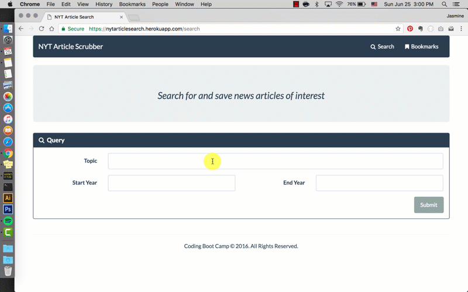

# NYT Article Search - Project Files

:arrow_upper_right:: https://nytarticlesearch.herokuapp.com/

## Overview

Basic CRUD app that demonstrates [NYT Article Search API](https://developer.nytimes.com/article_search_v2.json), utilizes React to build and route UI components, and Node, Express, and MongoDB to retrieve and delete bookmarked articles.

```
.
├── app
    ├── components
        ├── Search
            ├── Query.js
            └── Results.js
        ├── Search.js
        ├── Bookmarks.js
        └── Main.js
    ├── utils
        └── helper.js
    ├── routes.js
    └── app.js
├── public
    └── index.html
├── server
    └── Article.js
├── webpack.config.js
├── package.json
└── server.js
```

### Demo


## Copyright

Coding Boot Camp © 2017. All Rights Reserved.
